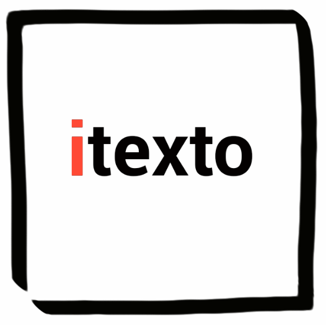

= Configurando seu ambiente de desenvolvimento Java com o SDKMan
Henrique Lobo Weissmann <kico@itexto.com.br> e Daniel Altamiro Oliveira Rodrigues <daniel@itexto.com.br>
:doctype: book
:revnumber: 1.0
:revdate: 5/9/2017
:revremark: Primeira edição
:description: Guia de referência rápida ao SDKMan
:front-cover-image: 
:toc:
:toc-title: Índice
:footer: itexto Consultoria - http://www.itexto.com.br

:homepage: http://www.itexto.com.br

== Sobre este guia

Uma das dificuldades mais comuns enfrentada por desenvolvedores Java diz respeito à configuração do seu ambiente de trabalho quando precisamos lidar com diferentes versões do JDK, ferramentas, tais como Maven, Ant, Gradle ou mesmo frameworks que oferecem interfaces de linha de comando, como Grails, Spring Boot ou Vert.x.

No dia a dia de desenvolvedores que se encaixem neste perfil não é raro se ver repetidas vezes alterando variáveis de ambiente como o PATH durante o dia. Muitos inclusive criam scripts que configuram o ambiente de acordo com o projeto no qual se está trabalhando.

Imagine nunca mais precisar alterar uma variável de ambiente quando precisar alterar a sua versão do JDK ou seu framework de trabalho. SDKMan te permite isto de uma forma muito fácil.

Pense na seguinte situação: você trabalha com diferentes projetos baseados no framework Grails (http://www.grails.org) e também do JDK. Com SDKMan, como você faz para usar a versão 1.6.0_45 do JDK com a 1.3.9 do Grails? Assim:

.....
sdk use java 1.6.0_45
sdk use grails 1.3.9
.....

Outra tarefa que pode ser um pouco chata é instalar estes componentes. Como isto seria feito com SDKMan? Usando dois comandos:

.....
sdk install grails 1.3.9
sdk install java 1.6.0_45
.....

Fácil, não? Neste guia rápido iremos entender como o SDKMan funciona.

Em nossa experiência trabalhamos com duas ferramentas que nos auxiliam muito nesta atividade. Começamos pelo Jenv, para o qual inclusive escrevemos um guia (http://www.itexto.com.br/guias/?guia=usando-jenv). Entretanto, conforme o tempo passou, acabamos usando cada vez mais o SDKMan em seu lugar (http://sdkman.io) pelas seguintes razões:

* O download das ferramentas era muito mais rápido.
* É a ferramenta recomendada pela equipe responsável pelo desenvolvimento do Grails (que usamos bastante).

No dia 5/9/2017, constatamos que por mais de dois dias o site oficial do Jenv estava fora do ar (http://jenv.io). Sendo assim, dado serem ferramentas tão parecidas, e o Jenv aparentemente "estar em crise", acabamos por tomar a decisão de reescrever nosso guia sobre o Jenv, desta vez o adaptando para o SDKMan.

A maior parte deste trabalho de adaptação do guia foi feita pelo Daniel (em sua primeira semana de estágio!) sob minha supervisão. Esperamos com isto que possamos, tal como fizemos no caso do Jenv, fornecer à comunidade um guia de fácil leitura para que vocês possam dominar a ferramenta o mais rápido possível.

Se você já era usuário do Jenv, muito provavelmente se sentirá extremamente confortável com o SDKMan, dado que os comandos são essencialmente os mesmos, com pouquíssimas variações.

== Sobre a itexto

Somos uma consultoria focada no desenvolvimento de software sediada em Belo Horizonte. Desenvolvemos sistemas de altíssima qualidade e ajudamos nossos clientes na execução desta tarefa através da nossa consultoria.

Atualmente nas seguintes frentes:

Treinamentos para empresas:: Ajudamos a sua empresa a dominar as tecnologias nas quais somos referência como, por exemplo, Groovy, Grails, Spring, Java EE
Treinamentos para desenvolvedores independentes:: Através da http://formacao.itexto.com.br[Formação itexto] oferecemos treinamentos voltados para desenvolvedores independentes nas tecnologias que dominamos.
Consultoria:: Projeto e crítica arquitetural, suporte a equipes de desenvolvimento e auxílio de aquisição
Desenvolvimento de sistemas customizados:: Atuamos no projeto, construção e implantação de soluções customizadas para nossos clientes
Evolução de sistemas legados:: Extraímos máximo valor da infraestrutura que nossos clientes já possuem

Atuamos em projetos tanto no Brasil quanto no exterior nas mais variadas áreas: financeira, comércio eletrônico, mineração, saúde, startups, produtos alimentícios, engenharia, tecnologia da informação, educação e pesquisa.

Além disto também atuamos junto com a comunidade de desenvolvimento de software a partir de algumas das nossas iniciativas:

http://www.groovybrasil.com.br[Groovy & Grails Brasil]:: uma das maiores comunidades do mundo de desenvolvedores que usam a linguagem Groovy e tecnologias relacionadas.
http://www.javascriptbrasil.com.br[JavaScript Brasil]:: comunidade de desenvolvedores JavaScript apoiada pela Itexto.
http://www.springbrasil.com.br[Spring Brasil]:: a comunidade de desenvolvedores Spring, também apoiada e mantida pela Itexto.
http://devall.com.br[/dev/All]:: nosso agregador de blogs de desenvolvedores
http://devkico.itexto.com.br[/dev/Kico]:: blog do nosso co-fundador, Henrique Lobo Weissmann (autor deste guia), que é considerado uma das principais referências sobre Groovy & Grails no Brasil
http://formacao.itexto.com.br[Formação itexto]:: aonde ministramos nossos treinamentos para desenvolvedores independentes nas tecnologias em que somos referência

Você pode entrar em contato conosco através do nosso site (http://www.itexto.com.br), telefone (31 2555-1979 ou 2573-1979) ou e-mail (administrativo@itexto.com.br).

<<<<

== Como instalar o SDKMan

=== Linux

Não é necessário ter o Java instalado para usar o SDKMan: tudo o que precisamos são do bash (você provávelmente já o tem instalado) e os comandos `cURL`, `zip` e `unzip` do Linux.

O primeiro passo consiste em digitar o comando a seguir na sua interface de linha de comando (CLI):

.....
curl -s "https://get.sdkman.io" | bash
.....

(caso o cURL não esteja instalado no seu computador, é fácil fazê-lo em sistemas baseados em Debian. Basta executar este comando: `apt-get install curl`. No caso de sistemas baseados em Yum, basta executar `yum install curl` (em ambos os casos, como root))

Talvez no seu computador também não esteja instalado o comando `unzip` e `zip`. Novamente, basta seguir o procedimento descrito nos parênteses acima, bastando para tal mudar o nome do que será instalado: `unzip` e `zip` respectivamente.

Logo na sequência, reinicie sua interface de linha de comando para poder usar o SDKMan ou, se preferir, execute o comando abaixo:

.....
source "$HOME/.sdkman/bin/sdkman-init.sh"
.....

Para testar sua instalação, basta executar o comando `sdk help`.

=== Windows

Neste guia, não iremos mostrar o passo a passo da instalação do SDKMan para o Windows, mas há uma versão que pode ser usada para o PowerShell e que é encontrada no link: http://sdkman.io/index.html

== Conceito importante: candidatos (Candidates)

No jargão do SDKMan, um `candidate` representa um software que é executado na JVM tais como, por exemplo, o Apache Ant, Maven, Grails, o próprio JDK, etc.

Para ver a lista completa, que irá expor também um breve resumo de cada candidato, execute o comando a seguir:

.....
sdk list
.....

Se executou o comando acima, viu que a lista é imensa! Se quiser, existe uma versão online desta lista neste link: http://sdkman.io/sdks.html.

== Instalando um candidato

A instalação de qualquer software pelo SDKMan é bastante simples, e consiste no fluxo abaixo:

* Liste todas as versões disponíveis para o candiato
* Mande instalar a versão desejada

O que pode ser refletido em dois comandos: o primeiro é o `sdk list [nome do candidato]`. A listagem a seguir expõe um exemplo ao listarmos todas as versões do Java que podem ser instaladas pelo SDKMan:

.....
sdk list java
Available Java Versions
================================================================================
     9ea14-zulu
     9ea13-zulu
     8u144-zulu
 > * 8u141-oracle
     8u131-zulu
     7u141-zulu
     6u93-zulu
.....

O asterisco indica as versões instaladas no sistema. O caractere de `maior que` (>) referencia a versão usada por padrão pelo usuário (veremos mais sobre isto adiante).

Imagine que você deseja instalar a versão 1.8.0_141 do JDK. Como proceder? Basta usar o comando `sdk install [candidato] [versão]`, tal como no exemplo a seguir:

.....
sdk install java 8u141-oracle
.....

O comando irá buscar pela versão pedida em um repositório central do SDKMan. Uma vez encontrada, é iniciado o processo de download e subsequente instalação do mesmo.

== Escolhendo a versão padrão de um candidato

Muitas vezes temos mais de uma versão de um candidato instalado, mas na maior parte das vezes usamos apenas uma. Nestes casos é interessante definirmos qual a instalação padrão com a qual queremos trabalhar. Isto é feito com o comando `sdk default [candidato] [versão]`.

Imagine que o Java com o qual você mais trabalhe seja o 1.6.0_45. Basta executar o comando abaixo:

.....
sdk default java 1.6.0_45
.....

Este comando irá definir esta como a versão padrão do candidato a ser configurada em sua interface de linha de comando. Importante mencionar que sempre que é finalizada a instalação de um candidato pelo SDKMan, ele irá lhe perguntar se esta será a versão padrão.

=== E como faço para desinstalar?

Você usa o comando `sdk uninstall [candidate] [versão]`.

Exemplo: para desinstalar o Gradle 2.7 execute o comando a seguir.

.....
sdk uninstall gradle 2.7
.....

== Usando uma versão diferente do candidato

Tal como antes mencionado, basta usar o comando `sdk use [candidato] [versão]`. Para usar o JDK 1.8.0_75, portanto, bastaria executar o comando a seguir:

.....
sdk use java 1.8.0_75
.....

<<<<

== Lidando com repositórios

O SDKMan armazena localmente a lista de todas as versões dos candidatos disponíveis em seu repositório central. Muitas vezes novas versões são lançadas, incluídas neste repositório e não aparecem na sua listagem local.

Este problema pode ser facilmente resolvido executando-se o comando abaixo:

.....
sdk flush candidates
.....

O índice do seu repositório local estará atualizado e agora aquela nova versão estará disponível para você.

=== Atualizando o próprio SDKMan

Muitas vezes é interessante atualizar o próprio SDKMan. Para tal, basta executar o comando abaixo:

.....
sdk selfupdate
.....

Caso uma nova versão do SDKMan exista, esta será instalada em seu computador.

<<<<

== Jenv ou SDKMan?

Até bem pouco tempo atrás recomendávamos a todos os nossos clientes a adoção do Jenv ao invés do SDKMan pelas seguintes razões:

* Apenas no Jenv existiam candidatos para o JDK.
* O número de candidatos era muito maior.
* Era muito mais fácil de ser instalado em sistemas Windows.

Entretanto, as coisas mudaram um pouco desde que lançamos nosso guia do Jenv:

* Agora no SDKMan é possível ter acesso a praticamente todas as versões do JDK.
* O número de candidatos, se não for igual, pelo menos contém tudo o que nossos clientes precisam para trabalhar, assim como nossa equipe interna (de que adianta um repositório com inúmeras alternativas se usamos tão poucas delas?)
* Observamos que o download de candidatos a partir dos repositórios do SDKMan era *muito* mais rápido que os vindos do *Jenv* em nossas experimentações.
* E o site do Jenv ficou fora do ar alguns dias (este guia foi publicado no dia 5/9/2017 e ele ainda estava indisponível).

O último ponto foi o que nos motivou a substituir o Jenv pelo SDKMan e desrecomendá-lo para nossos clientes. Fato é que o número de apoiadores do projeto SDKMan é muito maior que o do Jenv e, portanto, a possibilidade de problemas de indisponibilidade é significativamente reduzida.

Uma pena, mas torcemos para que o Jenv volte o mais rápido possível para que possamos ter ao menos mais de uma alternativa, o que sempre é saudável.
